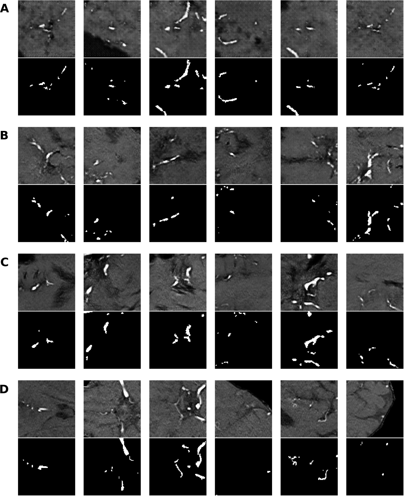

# Project documentation

This repository contains the code for the GAN architectures in [Anonymization of labeled TOF-MRA images for brain vessel segmentation using generative adversarial networks](https://arxiv.org/abs/2009.04227)

## General information

**Aim**: Generating realistic looking image-label patches of TOF-MRA images

**Input**:

* Generator - Noise vector of size 100
* Discriminator - Output of the generator (fake image-label pair) or PEGASUS patches (real image-label pair).

**Output:** 

* Generator - Generated image-label pair
* Discriminator - Score if image-label pair looks realistic or generated

**Architectures:** 

* Deep Convolution Generative Adversarial Network (DCGAN) 
* Wasserstein-GAN with gradient penalty (WGAN-GP) 
* WGAN-GP with spectral normalization (WGAN-GP-SN)

## Files

The following files are included in the DCGAN and WGAN_GP folders:
* [config.py]({{config.py}}): here you can change the configuration parameters for [train.py]({{train.py}}) and [test.py]({{test.py}})
* [utils.py]({{utils.py}}): has some utility functions used in [train.py]({{train.py}}) and [test.py]({{test.py}})
* [model.py]({{model.py}}): module with the model definition
* [train.py]({{train.py}}): training of generator and discriminator
* [test.py]({{test.py}}): get test images in compressed .npz form

## Results

In the figure below, real and synthesized image patches with corresponding labels are shown. (A) to \(C) show image-label pairs generated by DCGAN (A), WGAN-GP (B) and WGAN-GP-SN \(C) respectively. (D) show real patches and corresponding labels. The synthesized patches resemble real vessel patches and the labels fit well to the patches, especially those generated by WGAN-GP-SN \(C).

